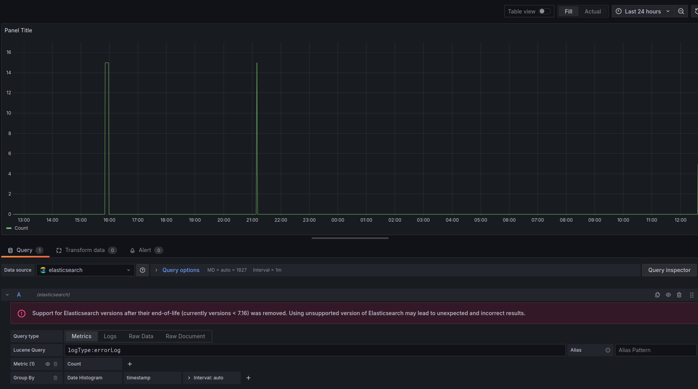

# Log Processor Application

## Overview

This Log Processor Application is designed to ingest, process, store, and visualize logs. The system leverages Kafka for distributed streaming, Elasticsearch for storage, and Kibana for visualization. The architecture follows a microservices approach, ensuring scalability and maintainability.

## Features

- **Real-time Log Ingestion**: Captures logs from various sources in real-time.
- **Log Processing**: Parses and enriches log data.
- **Storage**: Stores logs in Elasticsearch for efficient querying and analysis.
- **Visualization**: Uses Kibana to visualize and analyze log data.
- **Monitoring and Alerting**: Tracks error rates, latency, and other metrics for proactive monitoring.

## Architecture

- **Kafka**: Used for log ingestion and message brokering.
- **Elasticsearch**: Stores log data and provides powerful search capabilities.
- **Kibana**: Visualizes log data and provides an interface for querying Elasticsearch.
- **Flask**: Provides APIs for querying log data.

## Prerequisites

Ensure you have the following installed:

- Docker
- Docker Compose

## Project Structure

```plaintext
├─ log-processor/
│    └── services/
│        ├── log-ingestion/
│        │   └── producer.py
│        ├── log-storage/
│        │   └── storage.py
│        ├── log-query/
│        │   └── app.py
│        └── log-enhancer/
│            └── enhancer.py
├─ README.md
└─ docker-compose.yml

```

# Setup

## Step 1: Clone the Repository

```console
git clone https://github.com/ayushgarg2702/LogPipeLine.git
```

## Step 2: Start the Docker Containers

Ensure no other services are using the required ports (e.g., 9200, 9300, 5601, 2181).
```console
docker-compose up -d
```

## Step 3: Verify Elasticsearch is Running

Check the health of the Elasticsearch cluster.
```console
curl -X GET "http://localhost:9200/_cat/health?v"
curl -X GET "http://localhost:9200/_cat/indices?v"
```

## Step 4: Start the Log Producer

Run the log producer to start ingesting logs into Kafka.
```console
cd services/log-ingestion
python3 producer.py
```

## Step 5: Start the Log Storage Service

Run the storage service to read logs from Kafka and store them in Elasticsearch.
```console
cd ../log-storage
python3 storage.py
```

## Step 6: Start the Log Query Service

Run the query service to provide APIs for querying log data.
```console
cd ../log-query
python3 app.py
```

## Step 7: Access Kibana

Open Kibana in your browser to visualize the logs.
```console
http://localhost:5601
```

## Step 8: Configure Kibana Index Pattern

1. Navigate to the Discover tab.
2. You should be prompted to create an index pattern.
3. Set the index pattern to logs and configure the timestamp field.
4. Save the index pattern.


# Usage

## Ingesting Logs
- The producer.py script generates and sends logs to Kafka.

## Storing Logs
- The storage.py script consumes logs from Kafka and stores them in Elasticsearch.

## Querying Logs
- The app.py script provides an API to query logs from Elasticsearch.

## Visualizing Logs
- Use Kibana to visualize and analyze the logs.

## Cleanup
- To stop and remove all containers, networks, and volumes used by Docker Compose:
```console
docker-compose down
```

# To get the docker log service wise

```console
docker ps
docker logs <kafka_container_id>
```

# If Kafka storage is full. And you want to delete its data

- Either we can delete the data
```console
docker ps
docker exec -it <kafka_container_id> /bin/bash
kafka-topics.sh --list --bootstrap-server localhost:9092
kafka-console-consumer.sh --bootstrap-server localhost:9092 --topic <your_topic> --from-beginning
kafka-console-consumer.sh --bootstrap-server localhost:9092 --topic parsed-logs -- property print.key=true --property print.timestamp=true
kafka-topics.sh --delete --topic <your_topic> --bootstrap-server localhost:9092
docker-compose exec kafka kafka-topics.sh --delete --topic <your_topic> --bootstrap-server localhost:9092
```

- Or we can remove the current kafka and use new kafka
```console
docker-compose down
docker-compose rm -f kafka
docker volume ls
docker volume rm <volume_name>
docker-compose up -d
```

- Or update the docker-compose.yml file
```console
KAFKA_MESSAGE_MAX_BYTES: 200000000
KAFKA_REPLICA_FETCH_MAX_BYTES: 200000000
KAFKA_LOG_RETENTION_HOURS: 168  # 7 days
```

# Extended Feature

## Grafana

- Install grafana
```console
docker pull grafana/grafana
docker run -d --name=grafana -p 3000:3000 grafana/grafana
```

- We can EleasticSearch data for monitoring using grafana, also we can set alerts also.
- Check Elasticsearch for Logs
```console
curl -X GET "localhost:9200/logs/_search?pretty"
```

- Configure Elasticsearch as a Data Source in Grafana
- - Access Grafana:
- - * Open your browser and navigate to http://localhost:3000.
- - * Log in with the default credentials admin/admin.

- - Add Elasticsearch Data Source:
- - * Navigate to Configuration > Data Sources.
- - * Click on Add data source.
- - * Select Elasticsearch.

- - Configure Elasticsearch Data Source:
- - * Name: Give your data source a name (e.g., Elasticsearch).
- - * URL: Enter http://elasticsearch:9200 (since both Elasticsearch and Grafana are on the same Docker network, elasticsearch is the hostname used in Docker).
- - * Index name: Enter logs.
- - * Timestamp field name: Enter timestamp.

- - Save & Test the configuration.

-  Create a Dashboard in Grafana
- - Create a New Dashboard:
- - * Navigate to Create > Dashboard.
- - * Click Add new panel.

- - Query Elasticsearch:
- - * In the Query section, select Elasticsearch from the Data Source dropdown.
- - * This query will retrieve all logs from the logs index.
```console
* 
```

- - * To filter logs by a specific log type, for example, debugLog:
```console
logType:debugLog
```

- - * To filter logs within a specific date range, for example, logs from the last 24 hours:
```console
timestamp:[now-24h TO now]
```

- - * To filter logs that contain a specific message, for example, logs that contain the word error in the message field:
```console
message:error
```

- - * To combine multiple filters, for example, logs that are of type errorLog and were created in the last 24 hours:
```console
logType:errorLog AND timestamp:[now-24h TO now]
```

